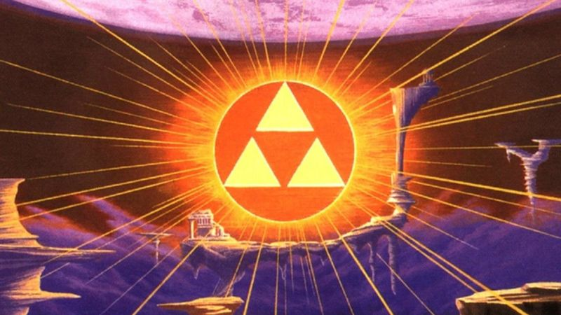
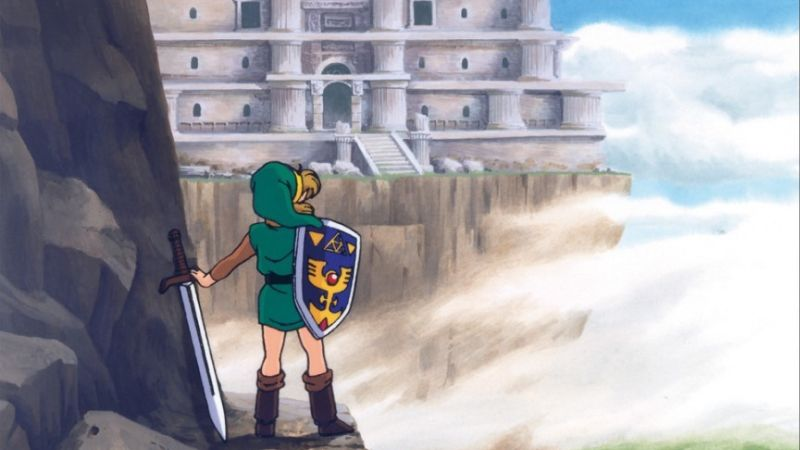
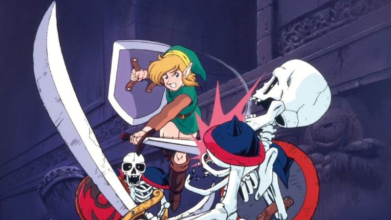
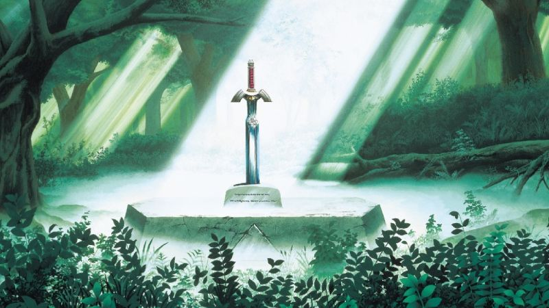

### Presentation

**The Legend of Zelda: A Link to the Past Project** is a remake of the classic and iconic game from the **Super Nintendo (SNES)**, originally released in *1991* (*1992* in *Europe*) which will be revisited on the **Game Boy Advance** in *2002*, alongside **The Legend of Zelda: Four Swords**, a multiplayer game.  

**The Legend of Zelda: A Link to the Past** will be reissued numerous times on various Nintendo consoles in the future and will also receive a tribute game on the **Nintendo 3DS** called **The Legend of Zelda: A Link Between Worlds**, which will take up gameplay ideas, the journey between two worlds, in an original story and some modern gameplay ideas !  

### Description

This remake, made with Solarus, uses the graphic elements of the **Super Nintendo (SNES)** version, featuring characters, enemies, and landscapes from the original game.  

With a few differences (mainly due to the modernity of the **Solarus Engine** and the PC system), the game will closely resemble the original discovered on the **Super Nintendo (SNES)**.

### Scenario

**Link** wakes up at home, after receiving a telepathic distress call from a young woman, **Zelda**, *Princess* of the **Hyrule Kingdom** !  

In the midst of a storm, **Hero's** **Uncle** goes outside, armed with a sword and shield, to go to the **Hyrule Castle**.  

**Link** decides to follow him and thus respond to the request of **Princess Zelda**.

This is how you will embody **Link** and thus experience his adventure, saving **Princess Zelda**, as well as the **Kingdom of Hyrule** threatened by **Dark Forces** !

### Gameplay System

This game reproduces the gameplay system of **The Legend of Zelda: A Link to the Past (SNES)** somewhat modernized by the **Solarus Engine** !  

A bit more dynamic, thanks to the PC platform, with modern key assignment system, you can play with a controller or keyboard according to your preferences.  

### Lifespan

For players who might eventually discover this title, or even the entire series (or simply the **2D Zelda** games), the estimated lifespan of the complete game is about thirty hours for completionists.

### Development

This game is currently under development. However, you will still be able to play demo versions with each update.  

##### **v0.3.x**
This version includes:
- The map of the **Light OverWorld**, with jumpers, without enemies, and featuring caves, houses, and generic dungeons...
- *Map created entirely by **KaKaShUruKioRa**.*
- The **Introduction** of the game with **Uncle**, **Zelda** & the **Hyrule Castle** & his **Secret Passage** in the **Sewers**
- The very first in-game dungeon, namely **Eastern Palace**, where you can obtain an item and battle your way to the final boss of the dungeon.  
However, there won't be a **Map** and a **Compass** for the time being.  
- *Map created by **ZeldoRetro** and **Boss** developed by **DarkDavy15**.*